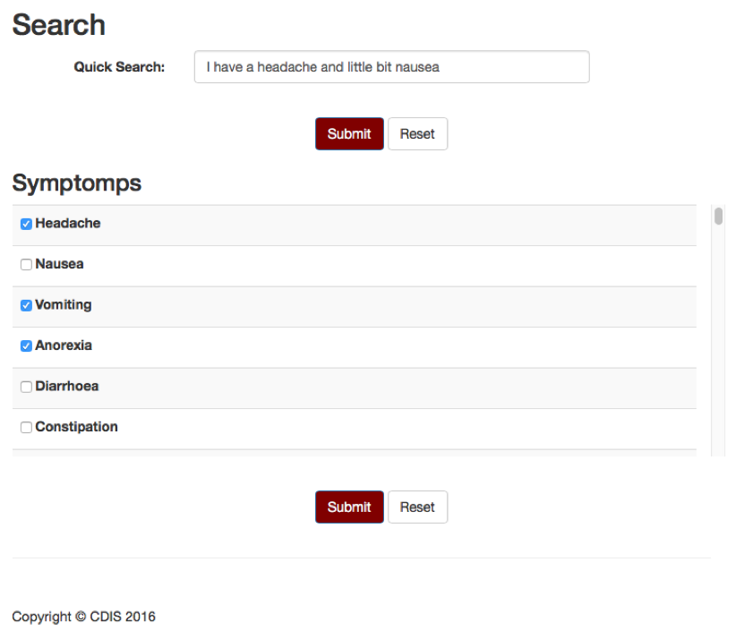

# CDIS

This Readme presents Cancer and Disease Identification System (CDIS), an online identification system for different types of cancers and diseases. CDIS database has been populated with 100+ cancer and disease types and 200+ symptoms via multiple available web pages. It is vital for the cancer to be diagnosed in an early stage. Certain cancer types have the same symptoms as an everyday sickness, while some cancer types might not show any symptoms until the stage of the cancer increases. CDIS calculates the possibilities for each cancer and disease and shows patient the possible outcomes and possibilities. 

## Usage

When you clone it, put the master folder to your web server directory. Then, import the cdis.sql file to your mysql database. By default, it will create a new database called as cdis with the tables. In case if it does not work, you can use cdisTable.sql to import only the tables into the database you created. By default, it will only create a patient profile. In order to create a surgeon account, you have to create a user as usual. Then, change `type` to `1` and add `hospital` information in `user` table in the database. P.S: The social media module is not available right now.

## Introduction

In this file, I present Cancer and Disease Identification System (CDIS). CDIS is an online database driven identification system regarding different cancer and disease types. Most patients with cancer/disease symptoms don’t investigate their symptoms due to their symptoms being the same as an everyday sickness. Symptoms get more severe as cancer spreads and the stage of the cancer increases. 

There exists 100+ cancer and disease types in CDIS. Cancers and Diseases can be severe if they are not diagnosed with the first symptoms [1]. Also there exists cancers that may not cause any symptoms until the tumor grows large. In certain cases, patients understand symptoms but are not resourceful enough to explore the causes of their symptoms.

CDIS database has been populated after a thorough search through the web for cancers and symptoms. Multiple sources have been exploited and the symptoms list has been generated for each cancer and disease in the database. CDIS allows users to search for their symptoms by either selecting from 200+ symptoms or typing their symptoms in a sentence form. According to the given symptoms CDIS calculates the possibilities for each cancer and disease, and displays the probabilities. Each possibility creates a hyperlink which explains each cancer or disease. 

## Methodology

In Cancer and Disease Identification System, HTML, Bootstrap, CSS, MeteorJS, MongoDB, JavaScript and JQuery were used for user interface while PHP was used for backend processes and MySQL database system was used in order to store system information, diseases, cancers and their symptoms. CDIS consists of three modules; (1) Profile module, (2) Patient module, (3) Physician module. The overall system design is shown in Figure 1.

Figure 1: Overall system design

Profile module manages the sign in and sign up procedures for patients and physicians. User will be assigned as a physician if the system administrator approves. In this database, there are 6 tables. They are "contact", "history", "symptom", "disorder", "symp_dis" and "user" tables. In the user table, there exists a column which decides the patient or the physician. The deciding column is called the “type” column. According to this column, system calls to the patient or the physician module.

Patient module pulls personal information from profile module. A sub-module in the patient module is the search sub-module. There are two options in the search sub-module. One of them provides patient to write their symptoms in the form of a sentence and the other one provides to select symptoms from a list which includes 200+ symptoms. When patient submits his/her symptoms, search sub-module checks the cancer and disease tables and calculates their possibilities. Possible cancers and diseases are shown to the patient. When patient clicks on a cancer or disease, CDIS will open a Wikipedia tab about the clicked cancer and disease. Figure 2 shows the selection process and Figure 3 shows the possibilities of the cancers and diseases.

Figure 2: Symptom selection process

Figure 3: Cancers and diseases with their possibilities

Another sub-module is the message sub-module. Message sub-module permits patient to send their symptom records to a physician from the hospital of their choice. Figure 4 shows the patient’s symptom records, and his/her newest symptoms.

Figure 4: Patient’s symptom records, and the newest symptoms

In physician module, there is a contact sub-module which includes patient’s symptom records and information which are sent from the patient. Only physicians are allowed to see and edit the data sent from the patient. Patient sets up an appointment with the physician after sending his/her medical records. After medical examination, physician enters the prescription information to the contact sub-module and the system is synchronized automatically. Figure 5 shows the page that has the patient information seen in the physician module.

 

Figure 5: Patient information seen in the physician module

This system is protected by Hyper Text Transfer Protocol Secure (HTTPS) and Secure Socket Layer (SSL) certificate. SSL protocol uses what is known as an 'asymmetric' Public Key Infrastructure (PKI) system (Figure 6). An asymmetric system uses two 'keys' to encrypt communications, a 'public' key and a 'private' key. Anything encrypted with the public key can only be decrypted by the private key. MD5 128-bit hash algorithm is used for encryption of passwords and Google reCAPTCHA (Figure 7) is used for protection from automated login bots.

Figure 7: An Example of Google reCAPTCHA

Also, I implemented CDISBooK (Figure 8), social media module, which provides people to share their moments, follow each other and filter their status.

Figure 8: CDISBooK

## Conclusion and Future Work

I have designed and implemented CDIS as an informative tool for people with cancer and disease symptoms. Early diagnosis of cancers and certain diseases will prevent the mortality rate from growing further. CDIS allows users to set up appointments with physicians from surrounding hospitals. One of our future goals is to automate our database entry system to keep our database up to date with new symptoms, cancers and diseases. CDIS has been developed for hospitals in Central Arkansas. Another final goal is to increase the range of CDIS to every hospital in United States.
